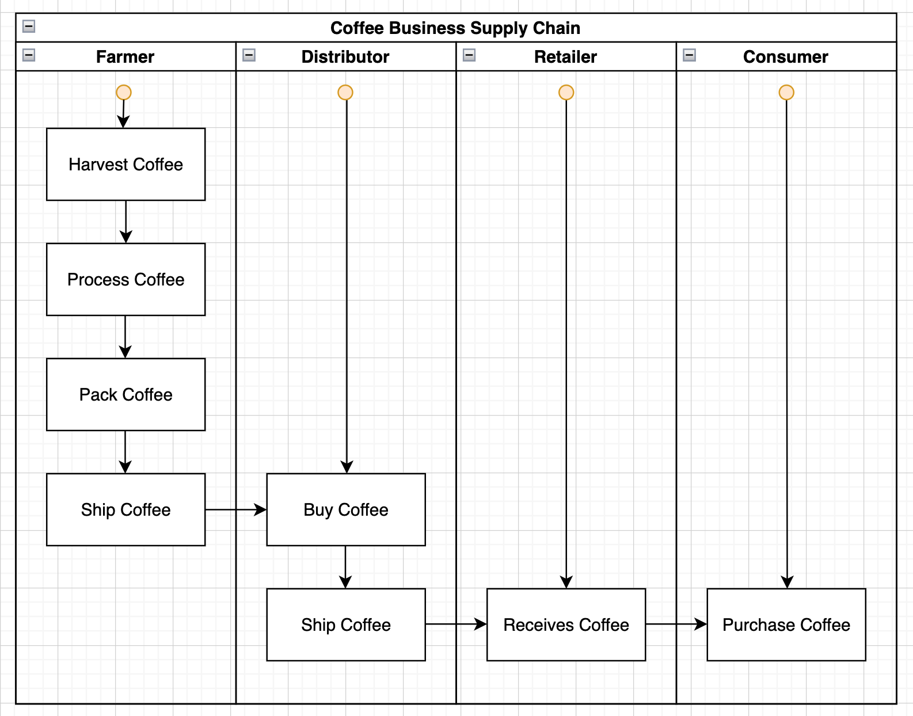
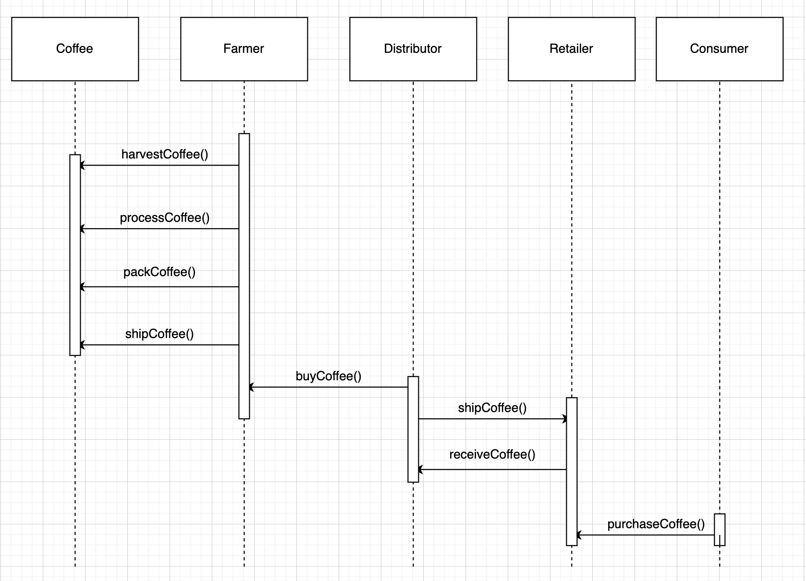
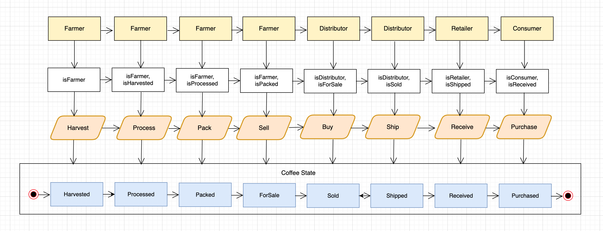
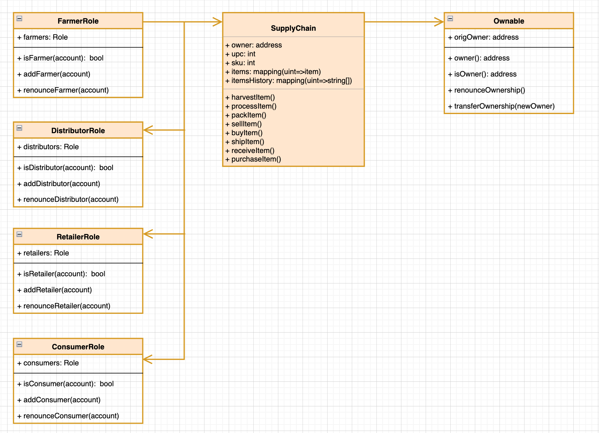

# Coffee Supply Chain dApp — Tracking items through the supply chain

This project shows how possible it is to make the supply chain management of any business possible by identifying all the assets and actors and they interact with each other transparently on the blockchain until the product of that business finally reaches it's final consumer.

## Library Versions

- Truffle v5.5.4 (core: 5.5.4)
- Solidity - 0.8.9 (solc-js)
- Node v14.17.5
- Web3.js v1.5.3
- @truffle/hdwallet-provider - ^2.0.4

## Getting Started

To get started testing this app all you have to do is make sure you have the aformentioned libraries installed, then open up your command line.

1. Navigate to `coffee-supply-chain` directory
2. Then execute the following command to start the server

```
    npm run dev
```

## UML Diagrams





## Contract details

- Transaction ID : ==0x481edd4be2e9f0878292bded565f40ced126d5c1883a232bcf995a778e151ff6==
- Contract Address : ==0xa972F5FF0ED182930a9d4cf69Ce0a21E1EaA18Be==